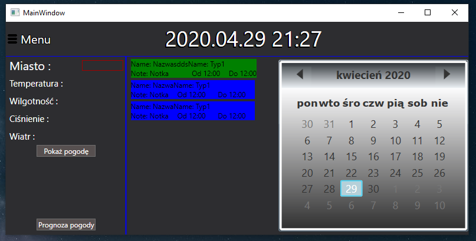
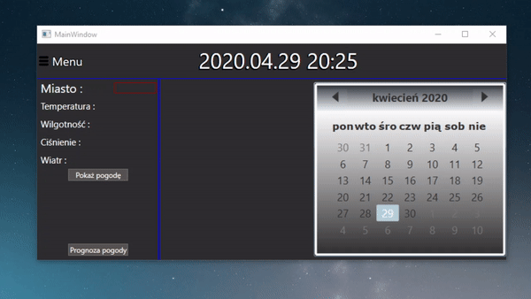
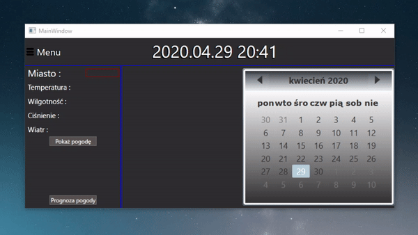
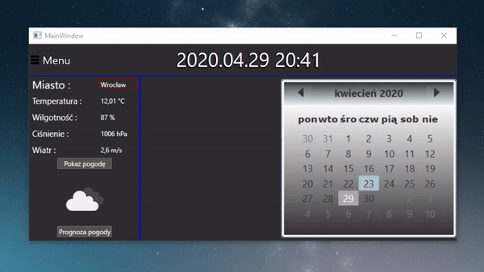
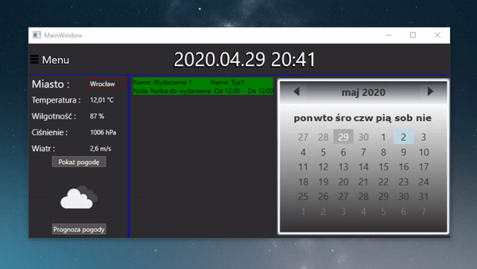
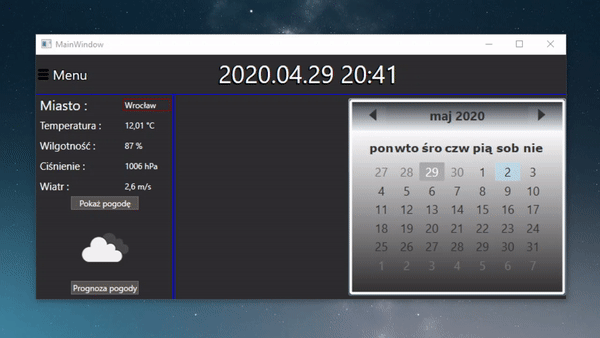

# Aplikacja "EventsCalendar"

|  Nr.   |   | |
| :------------: | :------------: | :------------: |
| 1 | Autorzy  | Przemys³aw Malec, Przemys³aw Widz|
| 2 | Jêzyk programowania | C# |
| 3 |  Technologia  | Aplikacja WPF (.NET Framework)  |
| 4 | NuGet   Packages | Newtonsoft.Json |
| 5 | Po³¹czenie z baz¹ danych | Entity Framework|
| 6 | IDE | Microsoft Visual Studio 2019 |
| 7 | API Pogoda | https://openweathermap.org/ |

## FunkcjonalnoϾ aplikacji : 
- mo¿liwoœæ sprawdzenia pogody oraz jej prognozy dla dowolnego miejsca na Ziemi dziêki API udostêpnionemu przez serwis https://openweathermap.org/ oraz zapytañ sieciowych zaimplementowanych w aplikacji 
- wygodny podgl¹d wydarzeñ w kalendarzu dziêki zastosowaniu ikonki **Calendar**
- estetyczny podgl¹d pogody stworzony z myœl¹ o wygodzie korzystania
- mo¿liwoœæ dodawania nowego wydarzenia do bazy danych oraz usuwanie ju¿ istniej¹cych 
- mo¿liwoœæ dodawania nowego typu wydarzenia oraz usuwania ju¿ dodanych typów

# Aktualna pogoda i jej prognoza 

#### Program pobiera takie informacje o aktualnej pogodzie jak :
- temperatura (w °C)
- wilgotnoϾ (w %)
- ciœnienie (w hPa)
- prêdkoœæ wiatru (w m/s)
- pobierana jest równie¿ grafika obrazuj¹ca opis pogody 

#### Program pobiera takie informacje dla ka¿dego dnia prognozy jak:
- dok³adna informacja o dacie (RRRR-MM-DD HH:MM:SS)
- temperatura (jednostka jak wy¿ej)
- ciœnienie (jednostka jak wy¿ej)
- prêdkoœæ wiatru (jednostka jak wy¿ej)

# Kontrola poprawnoœci zapytañ wysy³anych na serwer

Program kontroluje, czy zapytanie wysy³ane na serwer odby³o siê poprawnie.

# Dodawanie nowego wydarzenia

#### Przy dodawaniu nowego wydarzenia mo¿emy wprowadzaæ takie jego atrybuty,  jak :
- nazwa 
- data startu
- czas startu 
- data zakoñczenia 
- czas zakoñczenia 
- notatka 
- typ wydarzenia (wybierany z listy dostêpnych typów)

# Usuwanie istniej¹cego wydarzenia 

Poni¿szy gif obrazuje, jak wygl¹da usuwanie wydarzenia 

# Dodawanie nowego typu wydarzenia 

#### Przy dodawaniu nowego typu wydarzenia mo¿emy wprowadzaæ takie jego atrybuty,  jak :
- nazwa 
- kolor na kalendarzu (nie aktywny)
- kolor na liœcie

# Usuwanie istniej¹cego typu wydarzenia 

Poni¿szy gif obrazuje, jak wygl¹da usuwanie typu wydarzenia 

