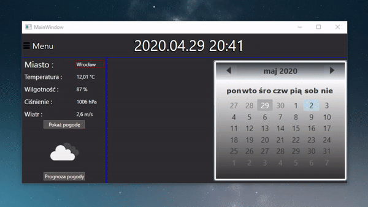

# Aplikacja "EventsCalendar"

# Aktualna pogoda i jej prognoza 

# Kontrola poprawnoœci zapytañ wysy³anych na serwer

# Dodawanie nowego wydarzenia

# Usuwanie wydarzenia 

# Dodawanie nowego typu wydarzenia 

# Usuwanie istniej¹cego typu wydarzenia 

